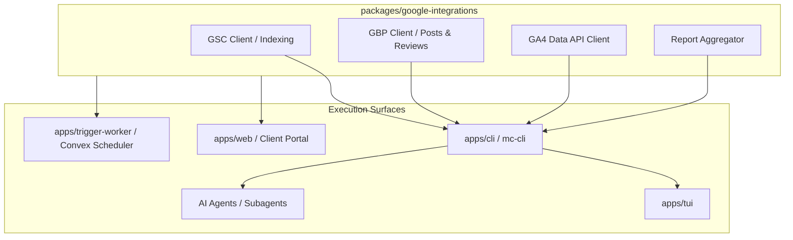

# Shared TypeScript Google API Libraries (GBP, GSC, GA4) & Master CLI Automation Engine

Digital marketing and local SEO agencies managed within Mission Control require native API integration with **Google Search Console (GSC)**, **Google Business Profile (GBP)**, and **Google Analytics 4 (GA4)** for both client management tools and aggregated reporting views across surfaces.

To enable seamless automation across humans, the TUI, background workers, and AI agents, all Google API logic is housed in a **shared TypeScript library** (`packages/google-integrations`), exposed through both Control Plane API endpoints and a dedicated **Master CLI tool** (`apps/cli` / `mc-cli`).

## Core Responsibilities

1. **Google Search Console (GSC)**:
   - **Live URL Inspection**: Query GSC URL Inspection API to test live URL status, indexability, canonical selection, and rich result validation.
   - **Indexing Requests**: Submit indexing requests (Index API / Inspection API trigger) for new or updated client URLs.
   - **Performance Aggregation**: Pull organic search impressions, clicks, CTR, and average position broken down by site, URL, and search query.

2. **Google Business Profile (GBP)**:
   - **Client Management Tools**: Create and schedule Google posts, update location business info, upload brand photos/media, and manage reviews.
   - **Local Engagement Metrics**: Pull calls, messages, direction requests, website clicks, and search impression metrics per location.

3. **Google Analytics 4 (GA4)**:
   - **Traffic & Conversion Aggregation**: Pull active users, total sessions, engagement rate, event counts, and conversion goal completions.

4. **Unified Report Aggregation**:
   - Normalize and merge multi-source data (GSC rank/traffic, GBP calls/messages, GA4 sessions/conversions) into standardized time-series structures for client report views and performance charts in Web, Client Portal, and TUI.

## Architecture

### Shared TypeScript Libraries (`packages/google-integrations`)

- Handles OAuth token lifecycle (refresh, secure storage in Convex/env, scoped permissions per ADR-0039).
- Implements rate-limiting, quota backoff, retries, and unified error handling.
- Formats normalized data models consumed by UI charts, report generators, and CLI output formatters (JSON/table).

### Master CLI (`apps/cli` / `mc-cli`)

- Command-line runner wrapping shared libraries and Control Plane API routes.
- Command scope:
  - `mc-cli gsc inspect --url <url>` / `mc-cli gsc index --site-id <id> --file <urls.txt>`
  - `mc-cli gbp post --location-id <id> --message <text> --media <url>`
  - `mc-cli report aggregate --client-id <id> --range 30d --format json`
  - `mc-cli poll status --client-id <id>`
- Enables human terminal power-users, shell scripts, TUI commands, and AI coding/ops subagents to execute management actions and poll client metrics without custom web scraping or manual browser actions.

## Why

- **Single Logic Source**: Prevents duplication of Google OAuth and API payload parsing between Web, Desktop, TUI, and worker scripts.
- **AI Agent Automation**: AI subagents and headless workers can run `mc-cli` or import shared libraries to perform live URL checks, trigger indexing, post GBP updates, and generate automated client performance reports.
- **Unified Reporting**: Combines separate Google metrics (GSC, GBP, GA4) into single-pane performance views for agency clients.

## Authentication Setup Paths & Endpoint Security

Detailed reference documentation is in [`docs/research/google-api-auth-and-cli-reference.md`](file:///Users/michael/Projects/mission-control-os/docs/research/google-api-auth-and-cli-reference.md).

1. **Path A: User OAuth2 PKCE Flow (Supports 3 Connection Modes)**:
   - **Mode 1: Agency Master Connection (`scope: "agency_master"`)**: Auth once at Agency settings for all current/future client sites (e.g. Agency GSC owner or GBP manager account).
   - **Mode 2: Per-Client Connection (`scope: "client_direct"`)**: Direct OAuth for a specific `ClientId`, overriding/supplementing the Agency master connection.
   - **Mode 3: Client Self-Auth Invite Link (`scope: "client_invite"`)**: Tokenized OAuth invitation link sent to new client owners (`/api/google/connections/invite`). Allows clients to connect their existing GSC/GBP/GA4 tools securely without an agency staff seat.
   - Handled via `/api/connections/google/auth` and `/api/connections/google/callback`.
   - Tokens stored in Convex `connections` table (encrypted, scoped by Agency or Client workspace per ADR-0039).

2. **Path B: Service Account JWT Flow (Unattended Background Automation)**:
   - Service Account key (`GOOGLE_SERVICE_ACCOUNT_KEY`) used for unattended cron/polling (Trigger.dev workers & Convex schedulers).
3. **Path C: Control Plane API Endpoint Security (`/api/google/*`)**:
   - Web UI / TUI / Desktop calls authenticated via Clerk JWT (`Authorization: Bearer <clerk_jwt>`).
   - `mc-cli` and AI subagent calls authenticated via `AgentToken` (`X-Agent-Token`) or API Secret (`X-MC-Api-Key`).
   - `google-auth-library` in `@mc/google-integrations` transparently refreshes expired OAuth tokens before firing Google API requests.

## Reference Codebases & Inspiration Sources

When building `@mc/google-integrations` and `apps/cli`, engineers and AI agents should reference the following codebases (see [`docs/research/google-api-auth-and-cli-reference.md`](file:///Users/michael/Projects/mission-control-os/docs/research/google-api-auth-and-cli-reference.md) for full breakdown):

- **`@gsc-cli/cli`**: Inspo for LLM-friendly CLI command structure, one-command OAuth setup, sitemap ingestion, structured `--format json` output, and URL inspection SDK patterns.
- **`google-indexing-script`**: Inspo for batch URL indexing request queueing, daily quota tracking, and exponential backoff.
- **`googleapis`**: Official Node.js/TS client for Search Console, Indexing, and Business Profile APIs.
- **`@google-analytics/data`**: Official Node.js/TS client for GA4 Data API (`BetaAnalyticsDataClient`).
- **`@googleworkspace/cli`**: Open-source CLI reference for token lifecycle management and CLI command extensibility.
- **`commander` + `@clack/prompts`**: Type-safe CLI subcommand routing and terminal UX.

## Consequences

- Must add `@mc/google-integrations` to workspace `packages/` and `apps/cli` to workspace `apps/`.
- Connected Accounts schema (ADR-0039) extended to store Google OAuth refresh tokens with per-Client or per-Agency ownership.
- Rate-limit and quota tracking required for Google Indexing and Inspection APIs.
- Comprehensive reference guide provided in `docs/research/google-api-auth-and-cli-reference.md`.

